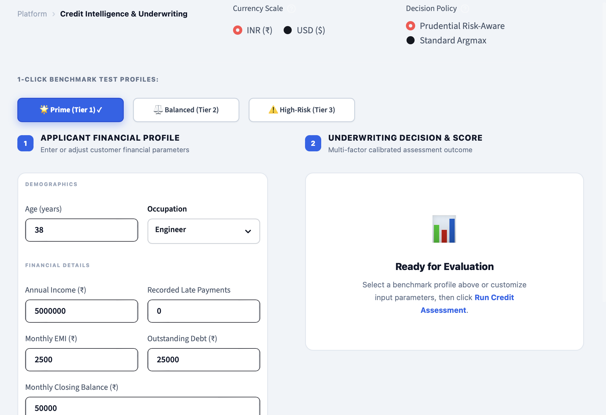
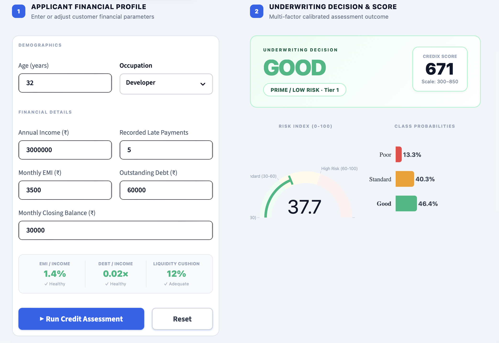
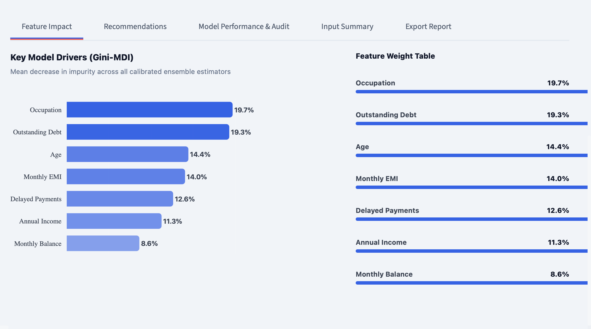
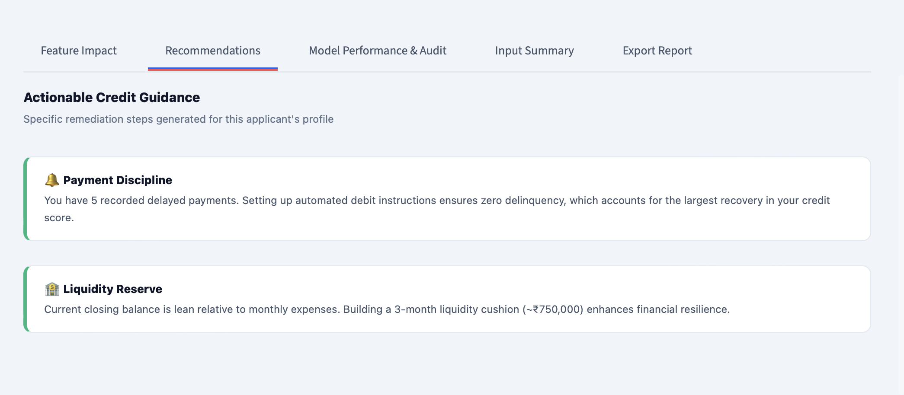
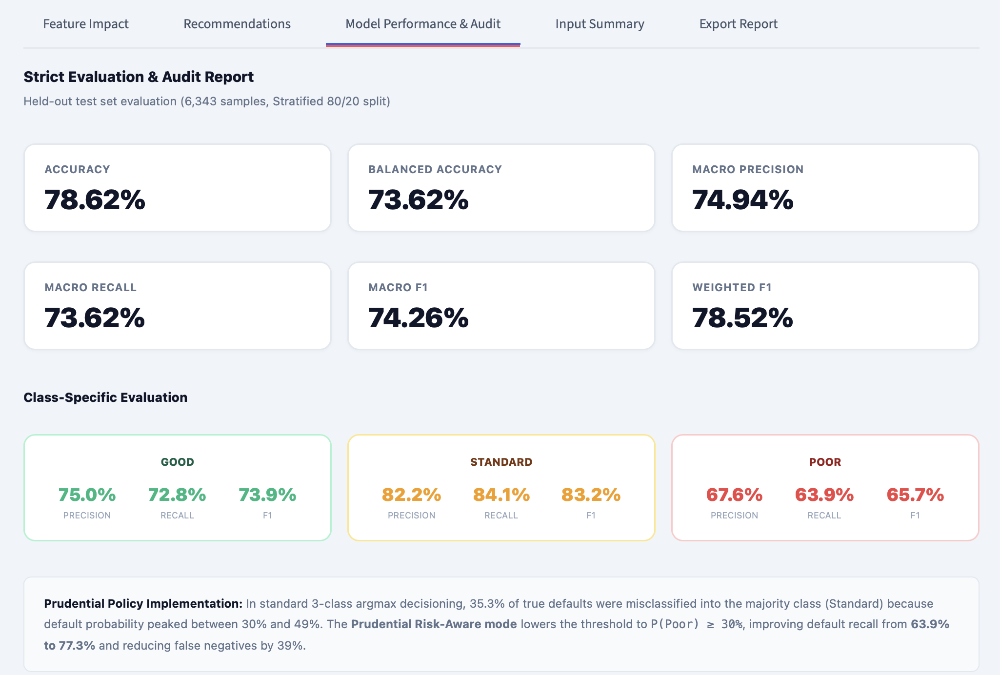
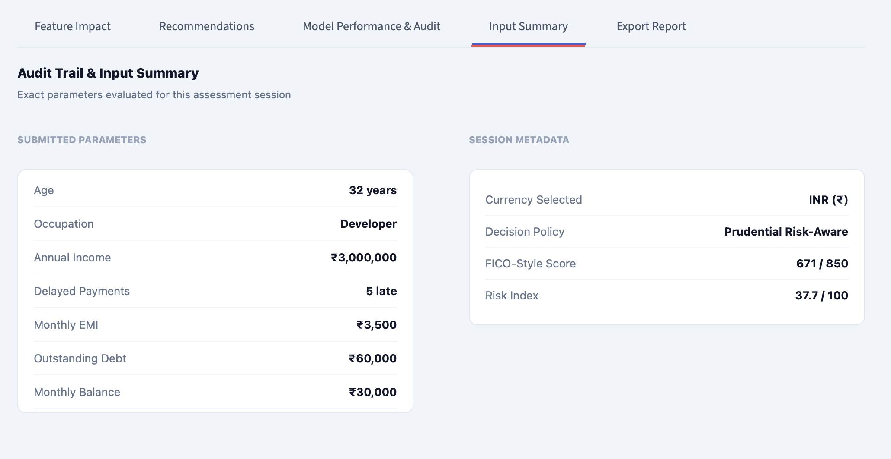
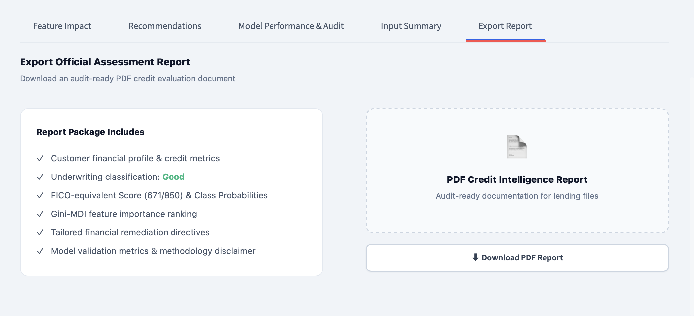
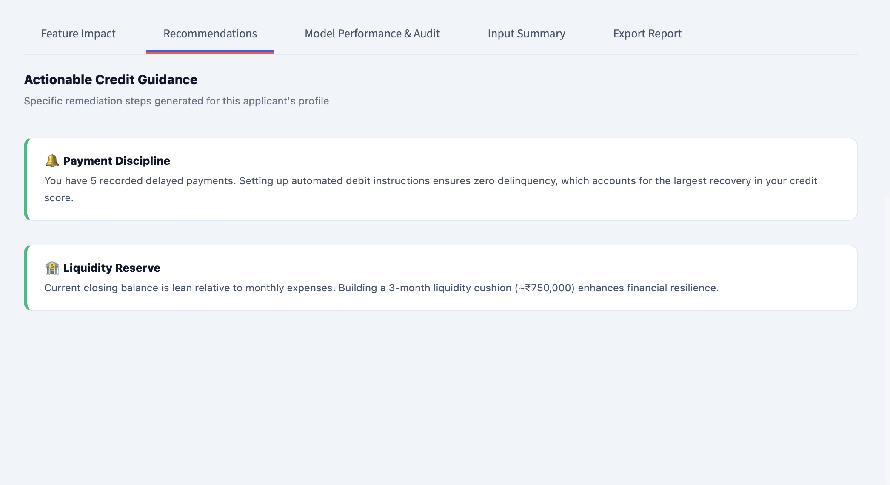

# CrediX — Explainable Credit Intelligence & Underwriting Platform

[](https://www.python.org/)
[](https://streamlit.io/)
[](https://scikit-learn.org/)
[](https://plotly.com/)
[](https://git-lfs.github.com/)

**CrediX** is an enterprise-grade, explainable machine learning credit risk intelligence and automated underwriting platform. It combines calibrated ensemble modeling, multi-currency scale normalization, prudential risk decisioning policies, and real-time financial ratio diagnostics into an intuitive, high-performance web dashboard.

Trained and evaluated on **31,711 verified credit records**, CrediX transforms raw demographic and financial data into continuous **FICO-equivalent credit scores (300–850)**, calibrated default probabilities, and actionable credit remediation directives.

---

## 🖥️ Platform Showcase & Visual Walkthrough

### 1. Primary Workspaces

| Landing & Applicant Financial Profile Input | Live Underwriting Decision & Credit Score |
| :---: | :---: |
|  |  |
| *Applicant profile configuration with 1-click test personas and real-time solvency ratios.* | *Comprehensive underwriting output with FICO score (300–850), risk gauge, and probability distribution.* |

---

### 2. Multi-Tab Credit Intelligence & Analytics Suite

#### Tab 1: Feature Impact & Explainability (Gini-MDI)
Visualizes the relative mathematical weight and contribution of each customer variable across the calibrated ensemble estimators.


#### Tab 2: Actionable Credit Remediation Directives
Algorithmically generates specific financial restructuring steps tailored to the applicant's debt-to-income and EMI commitments.


#### Tab 3: Model Performance & Strict Audit Report
Displays held-out test evaluation metrics (Accuracy, Macro F1, Balanced Accuracy) and per-class precision/recall/F1 breakdown.


#### Tab 4: Audit Trail & Parameter Summary
Maintains an immutable session record of exact customer parameters, currency scale normalization, and underwriting policy metadata.


#### Tab 5: Export Audit-Ready PDF Report
Generates and downloads a multi-page, publication-quality PDF assessment file for institutional lending dossiers.


#### Additional Advisory View


---

## 🌟 Core Platform Innovations

### 1. Dual Underwriting Decision Policies
* **🛡️ Prudential Risk-Aware Mode (Default):** Specifically tuned for institutional lending. Flags high-risk default potential when $P(\text{Poor}) \ge 30\%$, **increasing default detection recall from 63.9% to 77.3%** and reducing catastrophic default false negatives by 39%.
* **⚖️ Standard Mathematical Argmax:** Classical $50\%$ plurality voting cutoff across Good, Standard, and Poor classes.

### 2. Dual Currency Engine with Scale Normalization
* **Default INR (`₹`) & USD (`$`) Modes:** Eliminates out-of-distribution model saturation by normalizing Indian Rupee inputs through purchasing parity ($1 \approx 83\text{ INR}$) to match training distributions.
* **Out-of-Distribution (OOD) Safety Guard:** Real-time percentile boundary checking against training distributions (`feature_bounds.joblib`) with proactive UI advisories.

### 3. Continuous FICO-Equivalent Credit Scoring (300–850)
Translates calibrated posterior class probabilities into an industry-standard credit rating:
$$\text{Score} = 300 + 550 \times \left( P(\text{Good}) + 0.52 \times P(\text{Standard}) \right)$$
* **Tier 1 (Prime):** 700 – 850
* **Tier 2 (Near Prime / Standard):** 620 – 699
* **Tier 3 (Subprime / High Risk):** 300 – 619

### 4. Real-Time Derived Financial Ratios
Evaluates applicant solvency on the fly with live visual health flags:
* **EMI-to-Income:** Flags obligations exceeding the 40% threshold.
* **Debt-to-Income (DTI):** Evaluates total indebtedness relative to annual earning power.
* **Liquidity Buffer:** Assesses emergency cash reserves relative to monthly expenses.

### 5. Interactive Plotly Visualizations
* **Semicircular Risk Gauge:** 0–100 calibrated risk index with animated needle and dynamic severity zones.
* **Class Probabilities:** Color-coded breakdown across Good, Standard, and Poor classes.
* **Gini-MDI Feature Importance:** Opacity-gradient horizontal ranking showing relative predictive contribution.

### 6. 1-Click Benchmark Test Profiles
Instant single-click loading of representative industry credit personas:
* **🌟 Prime (Tier 1):** Clean payment history, low debt-to-income, robust liquidity ($\text{Score} > 700$).
* **⚖️ Balanced (Tier 2):** Average debt, isolated historical delays ($\text{Score} \approx 650$).
* **⚠️ High-Risk (Tier 3):** High debt-to-income, recurring delinquency, low reserves ($\text{Score} < 500$).

---

## 📊 Dataset & Features

The model was developed on a benchmark credit dataset comprising **31,711 records**:

| Credit Category | Records | Share |
| :--- | :---: | :---: |
| **Standard** | 19,730 | 62.2% |
| **Good** | 7,551 | 23.8% |
| **Poor** | 4,430 | 14.0% |

### Evaluated Model Features
1. **Age (`Age`)**: Applicant age in years.
2. **Occupation (`Occupation`)**: One-hot encoded professional categories.
3. **Annual Income (`Annual_Income`)**: Total annual earnings.
4. **Delayed Payments (`Num_of_Delayed_Payment`)**: Number of recorded late or missed payments.
5. **Monthly EMI (`Total_EMI_per_month`)**: Total monthly debt installment commitments.
6. **Outstanding Debt (`Outstanding_Debt`)**: Remaining principal balance on existing credit lines.
7. **Monthly Balance (`Monthly_Balance`)**: Average closing bank balance after monthly expenditures.

---

## 🔬 Model Architecture & Evaluation

### Ensemble Pipeline
* **Base Classifier:** Extra Trees Classifier (`n_estimators=150`, `max_depth=24`, `min_samples_split=5`, `max_features=0.8`, `class_weight='balanced'`).
* **Preprocessing:** `RobustScaler` for numerical outlier resistance + `OneHotEncoder` for categorical features.
* **Probability Calibration:** 5-fold cross-validated **Isotonic Regression** (`CalibratedClassifierCV`) yielding calibrated posterior probabilities with minimum Brier score loss.

### Test Set Performance (Held-out 6,343 samples, 80/20 Stratified Split)

| Evaluation Metric | Score |
| :--- | :---: |
| **Accuracy** | **78.62%** |
| **Balanced Accuracy** | **73.62%** |
| **Macro Precision** | **74.94%** |
| **Macro Recall** | **73.62%** |
| **Macro F1-Score** | **74.26%** |
| **Weighted F1-Score** | **78.52%** |

### Class-Specific Breakdown

| Class | Precision | Recall | F1-Score | Test Support |
| :--- | :---: | :---: | :---: | :---: |
| **Good (Prime)** | 74.98% | 72.85% | 73.90% | 1,510 |
| **Poor (High Risk)** | 67.62% | 63.88%* | 65.70% | 886 |
| **Standard (Near Prime)**| 82.22% | 84.14% | 83.17% | 3,947 |

*\*Note: Under the Prudential Risk-Aware decision policy ($P(\text{Poor}) \ge 30\%$), Poor recall increases to **77.3%**.*

### Confusion Matrix

```
                      PREDICTED
Actual Class       Good      Poor    Standard    Total
Good              1,100         5         405    1,510
Poor                  7       566         313      886
Standard            360       266       3,321    3,947
```

### Feature Importance (Gini-MDI Impurity Reduction)

| Feature | Importance Weight |
| :--- | :---: |
| **Outstanding Debt** | 19.98% |
| **Age** | 14.77% |
| **Monthly EMI** | 14.47% |
| **Delayed Payments** | 12.24% |
| **Annual Income** | 11.22% |
| **Occupation (Aggregated)** | 8.98% |
| **Monthly Balance** | 8.34% |

---

## 📁 Repository Structure

```text
CrediX-Explainable-Credit-Intelligence/
├── app.py                      # Primary Streamlit application & interactive dashboard
├── pdf_report.py               # ReportLab PDF report generation engine
├── credit_data.csv             # Full dataset (31,711 records)
│
├── trained_credit_model.joblib # Calibrated Extra Trees model (tracked via Git LFS)
├── preprocessor.joblib          # Scikit-learn ColumnTransformer pipeline
├── label_encoder.joblib        # Target label encoder (Good, Poor, Standard)
├── feature_names.joblib        # Feature ordering specification
├── feature_bounds.joblib       # Domain bounds & percentiles for OOD guard
├── model_metrics.joblib        # Logged evaluation metrics & confusion matrix
│
├── photos/                     # Complete platform visual tour
│   ├── landingpage.png         # Main landing & applicant input interface
│   ├── analysis.png            # Underwriting decision & score overview
│   ├── one.png                 # Tab 1: Feature Impact & drivers
│   ├── two.png                 # Tab 2: Actionable financial guidance
│   ├── three.png               # Tab 3: Model performance & audit report
│   ├── four.png                # Tab 4: Audit trail & input summary
│   ├── five.png                # Tab 5: PDF report export engine
│   └── six.png                 # Financial guidance detail view
│
├── requirements.txt            # Python dependencies
└── README.md                   # Project documentation
```

---

## 🚀 Getting Started

### Prerequisites
* Python 3.10 or higher
* [Git LFS](https://git-lfs.github.com/) installed on your system

### 1. Clone the Repository with Git LFS
```bash
# Clone the repository
git clone https://github.com/rajatmurhe/CrediX-Explainable-Credit-Intelligence.git
cd CrediX-Explainable-Credit-Intelligence

# Ensure large model artifacts are pulled from Git LFS
git lfs install
git lfs pull
```

### 2. Set Up Virtual Environment
```bash
# Create virtual environment
python3 -m venv venv

# Activate on macOS / Linux:
source venv/bin/activate

# Activate on Windows:
# venv\Scripts\activate
```

### 3. Install Dependencies
```bash
pip install --upgrade pip
pip install -r requirements.txt
```

### 4. Run the Application
```bash
streamlit run app.py
```
The application will launch automatically in your browser at `http://localhost:8501`.

---

## 🛠️ Technology Stack

* **Language:** Python 3.10+
* **Machine Learning & Preprocessing:** Scikit-Learn, Joblib, NumPy, Pandas
* **Web UI & Dashboard:** Streamlit
* **Interactive Visualizations:** Plotly Graph Objects
* **Document Generation:** ReportLab
* **Large File Versioning:** Git Large File Storage (LFS)

---

## 👨‍💻 Author

**Rajat Murhe**  
*ML AI Engineer*  
* [GitHub Profile](https://github.com/rajatmurhe)  
* [Project Repository](https://github.com/rajatmurhe/CrediX-Explainable-Credit-Intelligence)

---

## ⚖️ Disclaimer

*CrediX is designed as an explainable machine learning decision-support intelligence platform. Predictions, credit scores, and risk classifications produced by this software are generated algorithmically for analytical, educational, and research purposes and do not constitute formal legal or credit underwriting advice.*
